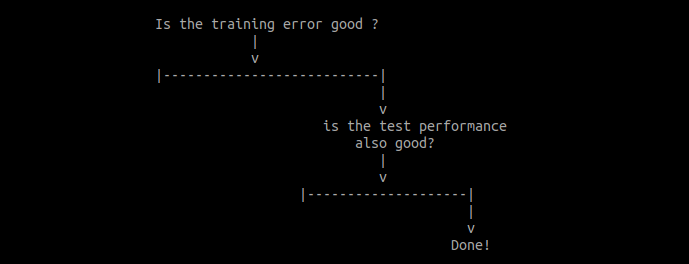
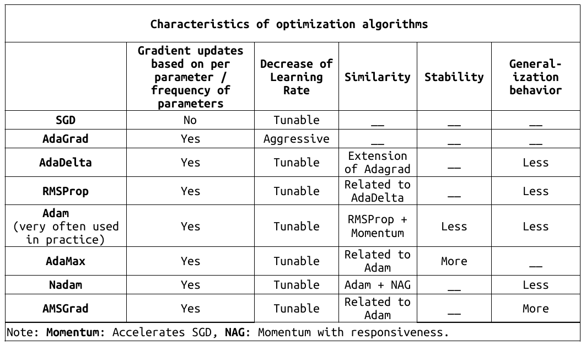
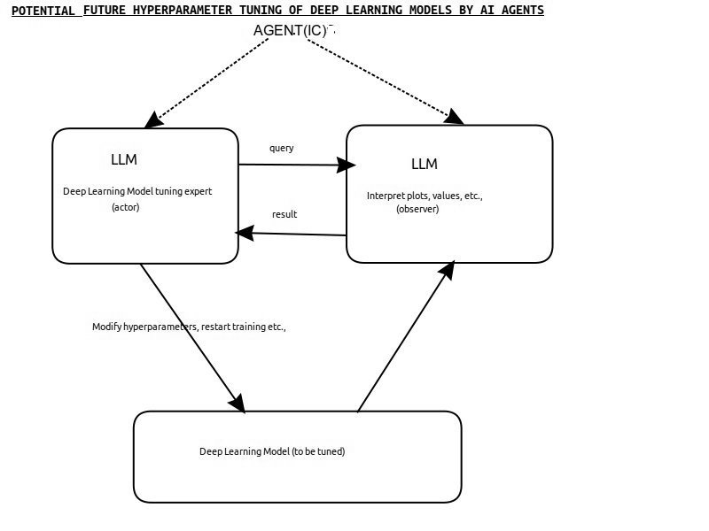

## Expert Systems for hyperparameter tuning and “telephone test”

Expert systems(ESs) are developed and used in medical diagnosis which involves taking patient’s symptoms and laboratory tests as inputs. These systems are used when the expertise required is “highly valued and complex”![[1]](https://en.wikipedia.org/wiki/Expert_system). Currently, using Deep Learning to solve problems is also a “highly valued and complex” task.

Medical diagnosis sounds analogous to Deep  Learning model tuning and also there are statements comparing Deep Learning to alchemy.

But, the appropriateness of using ES can be evaluated with a “telephone test”![[2]](https://engineering.purdue.edu/~engelb/abe565/es.htm) which states that in a telephone conversation if a domain expert can communicate with the user to solve a problem successfully, then ES can be used. The domain expert should be able to solve it consistently and also the information exchanged should be only verbal.  The “telephone test” also implies that we should be able to construct fixed-response questions, and they should be properly structured in a sequence for each decision ![[3]](http://dssresources.com/faq/index.php?action=artikel&id=230).

Observations:  
On the choice of optimization algorithms, we were able to tabularize(verbalize) these only to this point until now:

When it comes to model, we can get graphical output about the current status of the model with the help of training error/test error/number of epoch graph, visualizing gradients etc.,

By validating against the telephone test, and considering the resolution with which we are able to see the optimizations algorithms, and the questions about articulating about the status of the model, concluded not to pursue this further. 

Remember that the latest in research related to meta-learning is called bilevel optimization ![[4]](https://www.cs.toronto.edu/~rgrosse/courses/csc2541_2021/). Until we get fruitful results from meta-learning,  we can depend on guides like “XYZ's Principles and Practice of Deep Learning” along with the help of institutions that give a stint on this so that Deep Learning enthusiasts can get up to speed just like they do in the field of medicine.

Edited:July 20, 2024
-------------
I guess by now we have AI agents doing the hyperparameter tuning:

References: 

1) 

2) 

3) 

4) 
