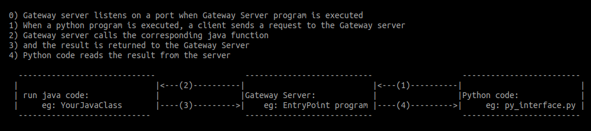

### How to use java code from python programs using py4j?
Consider your java class to be the following in a file [YourJavaClass.java](./YourJavaClass.java):

```
public class YourJavaClass {
    private int i, j, k, l, m;

    public YourJavaClass (){
        i = 1;
        j = 2;
        k = 3;
        l = 4;
        m = 5;
    }
    public int fun1Java(int a1, int a2){
        i = a1 + a2;
        return i;
    }
    public int fun2Java(){
        return j;
    }
    public int fun3Java(){
        return k;
    }
    public int fun4Java(){
        return l;
    }
    public int fun5Java(){
        return m;
    }
        
}
```


1. How to write a wrapper class EntryPoint (in file [EntryPoint.java](EntryPoint.java)) around your java class, YourJavaClass?

```
import py4j.GatewayServer;

public class EntryPoint{

    private YourJavaClass yourJavaObj;

    public EntryPoint(){
        yourJavaObj = new YourJavaClass();

    }

    public YourJavaClass getYourJavaClass (){
        return yourJavaObj;
    }

    public static void main(String[] args) {
        GatewayServer gatewayServer = new GatewayServer(new EntryPoint(), 25536);
        gatewayServer.start();
        System.out.println("Gateway Server Started");
    }
}
```

2. How to write a python program in a file [py_interface.py](py_interface.py) calling java functions?

```
from py4j.java_gateway import JavaGateway, GatewayParameters

class YourPythonClass():
    def __init__(self):
        gg = JavaGateway(gateway_parameters=GatewayParameters(port=25536))

        # one example of calling  
        p = gg.jvm.java.util.Random()
        print("Printing random number from the virtual machine: ", p.nextInt(10))

        # getting your class 
        self.g = gg.entry_point.getYourJavaClass()

    # and call functions of YourJavaClass   
    def fun1_py(self):
        return self.g.fun2Java(), self.g.fun3Java()/2.0, self.g.fun4Java()

    def fun2_py(self, arg1, arg2):
        return self.g.fun1Java(arg1, arg2)


c = YourPythonClass()
print(c.fun1_py())
print(c.fun2_py(2, 3))
```

3. Do we need  [py4j-0.10.9.jar](py4j-0.10.9.jar) ? 
   Yes. You need to download it (please check for the latest version and use it.)

4. Where can I store the downloaded py4j-0.10.9.jar file ?

   You can store it in the same directory as your EntryPoint.java

5. How to pass py4j jar file while compiling EntryPoint.java?

```   javac EntryPoint.java  -cp ".:py4j-0.10.9.jar"``` 

6. How to pass py4j jar file while executing the program EntryPoint?

```   java  -cp py4j-0.10.9.jar:. EntryPoint```

7. Do we have to leave EntryPoint server running before we call java functions from py_interface.py?

   Yes

8. How to execute your python program when EntryPoint is running ?

```   ./py_interface.py```

9. How does this work ?


